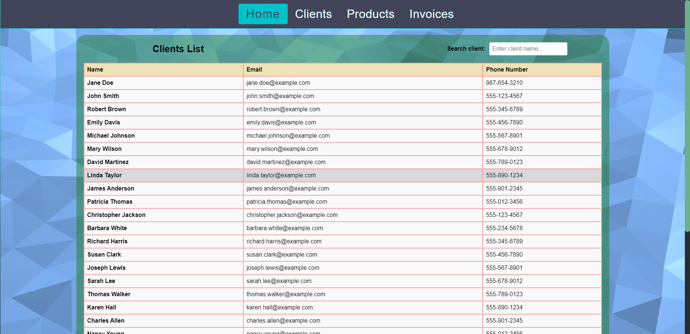
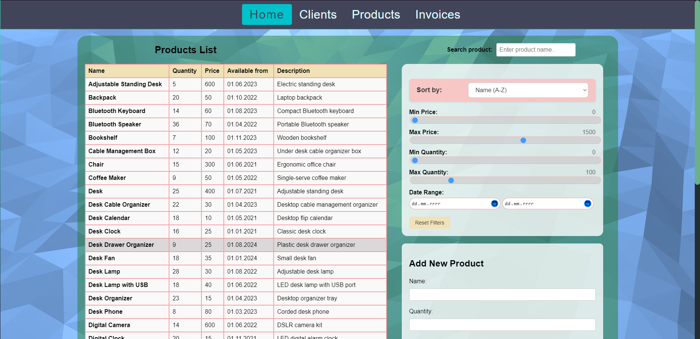
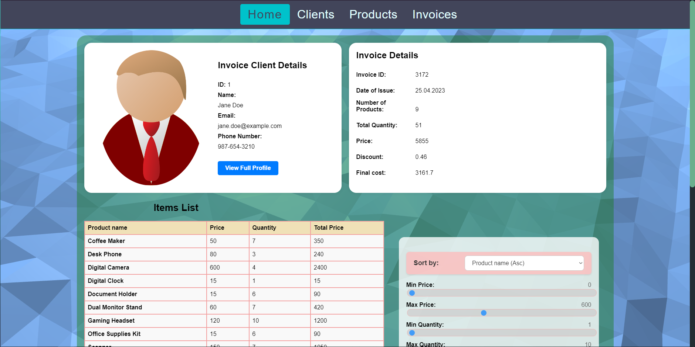
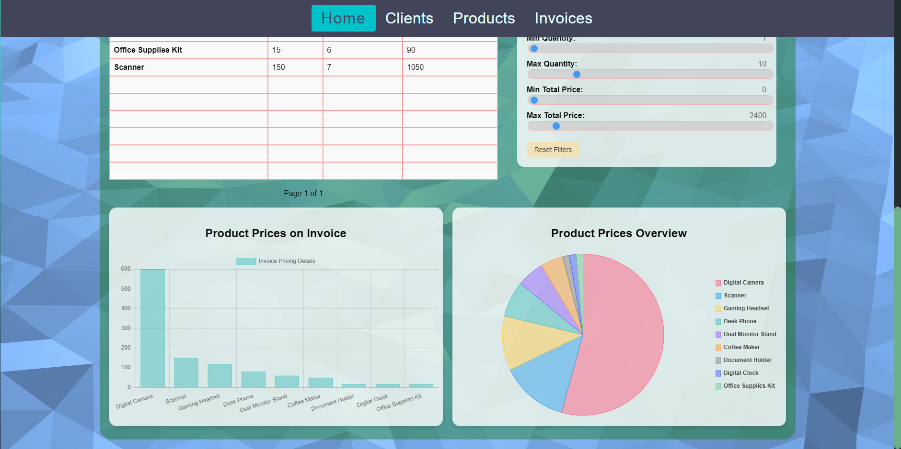

# Stock-Management-System

## About Project

**Stock Management System** is a sophisticated web application designed to provide comprehensive management and analytical capabilities for businesses. Built with a modern tech stack, including `React` for the frontend and `C#` with `Entity Framework` (EF) for the backend, this system leverages a `SQLite3` database to store and manage data efficiently.

## Key Features

- **Client Management**: 
  - Add, update, and manage client information seamlessly.
  - Maintain detailed records of client interactions and transactions.

- **Product Management**: 
  - Efficiently add, update, and organize products.
  - Keep track of stock levels, pricing, and product details.

- **Invoice Management**: 
  - Generate and manage invoices for clients.
  - Keep track of billing history and payment statuses.

- **Advanced Data Operations**:
  - Search, filter, and sort data with ease.
  - Quickly find relevant information to make informed decisions.

- **Data Visualization**: 
  - Use integrated charts and graphs to analyze data trends.
  - Visualize key metrics to make informed business decisions.

- **Backend API**: 
  - Developed in C# with EF, providing robust API endpoints for interacting with the SQLite3 database.
  - Ensures efficient data handling and integration capabilities.

- **SQLite3 Database**: 
  - Utilize a lightweight and efficient SQLite3 database for storing and managing data.
  - Ensure data integrity and quick access to records.

- **Secure Data Handling**: 
  - Implement security measures to protect sensitive client and product data.
  - Ensure secure transactions and data storage.

- **Scalable Architecture**: 
  - Designed to scale with your business.
  - Can handle increasing amounts of data and users without compromising performance.

## Technologies Used

- **Frontend**: 
  - React
  - HTML5
  - CSS3

- **Backend**: 
  - C#
  - Entity Framework (EF)

- **Database**: 
  - SQLite3

## Getting Started

### Prerequisites

- Node.js
- npm (Node Package Manager)
- .NET SDK

### Installation

1. Clone the repository:
    ```bash
    git clone https://github.com/yourusername/Stock-Management-System.git
    cd Stock-Management-System
    ```

2. Install frontend dependencies:
    ```bash
    cd .\webclient\
    npm install
    ```

3. Install backend dependencies:
    ```bash
    cd .\Server\
    dotnet restore
    ```

### Running the Application

1. Start the backend server:
    ```bash
    cd .\Server\
    dotnet run
    ```

2. Start the frontend development server:
    ```bash
    cd .\webclient\
    npm start
    ```

3. Open your browser and navigate to `http://localhost:3000` to see the application in action.

## Screenshots






## License

This project is licensed under the MIT License - see the [LICENSE](LICENSE) file for details.

## Acknowledgements

- [React](https://reactjs.org/)
- [Entity Framework](https://docs.microsoft.com/en-us/ef/)
- [SQLite](https://www.sqlite.org/index.html)